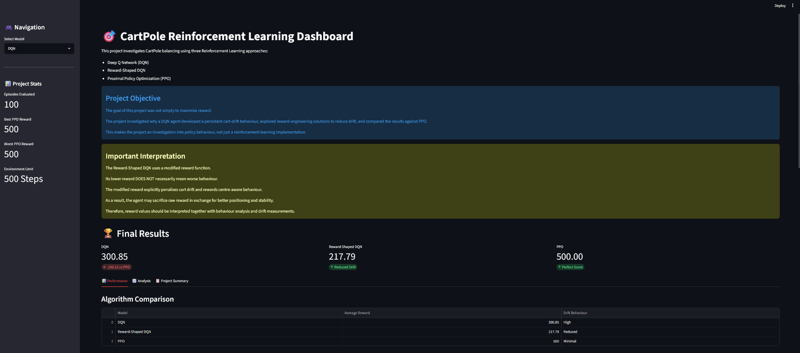
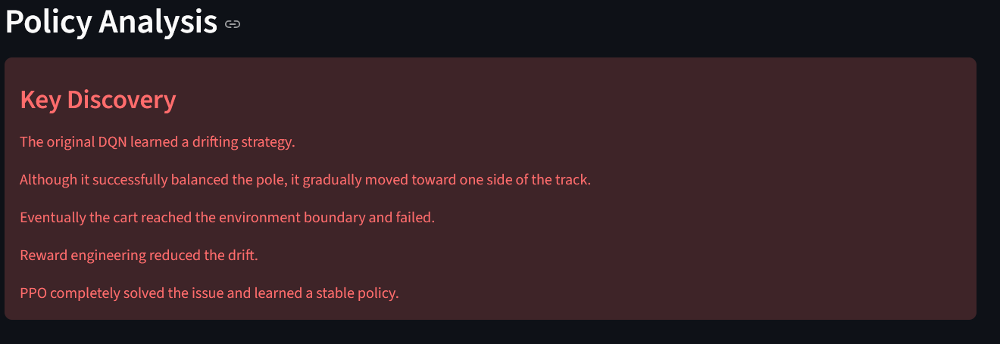
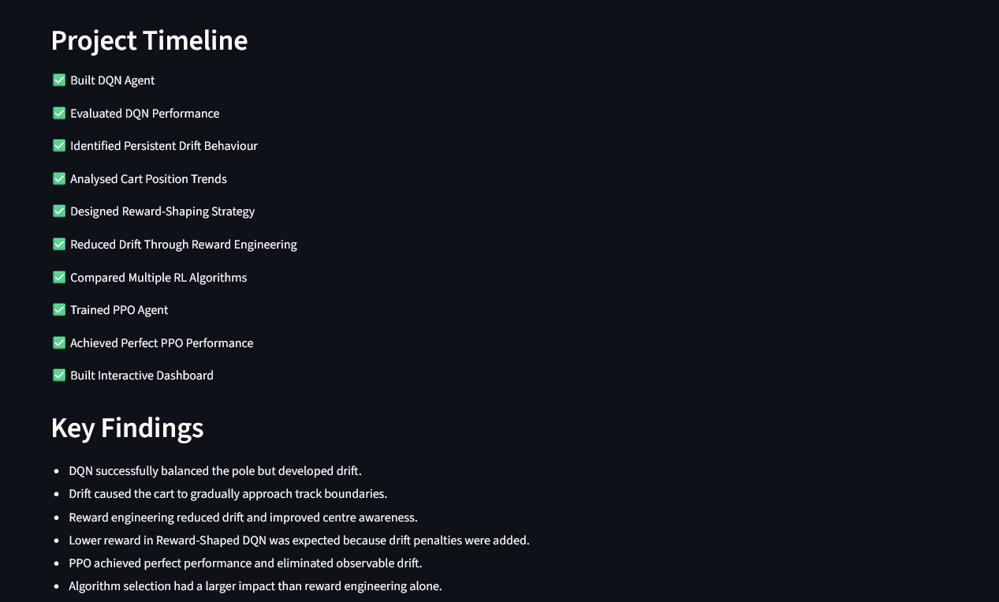

# 🎯 CartPole Reinforcement Learning Analysis

## Overview

This project investigates different Reinforcement Learning (RL) approaches for solving the CartPole-v1 control problem.

Unlike a standard CartPole implementation that focuses only on maximizing reward, this project explores how different RL algorithms behave, analyzes policy drift, applies reward engineering techniques, and compares algorithm performance.

The project evaluates:

* Deep Q Network (DQN)
* Reward-Shaped DQN
* Proximal Policy Optimization (PPO)

---

## Project Objective

The primary goal was to investigate an unexpected behaviour observed in a DQN agent.

Although the DQN successfully balanced the pole, it gradually drifted toward the edge of the track. This project explores:

* Why the drift occurs
* Whether reward engineering can reduce the drift
* How alternative RL algorithms compare
* Which approach produces the most stable control policy

---

## Technologies Used

* Python
* Gymnasium
* Stable-Baselines3
* PyTorch
* NumPy
* Pandas
* Matplotlib
* Streamlit

---

## Reinforcement Learning Workflow

### 1. DQN Agent

A Deep Q Network (DQN) agent was trained on CartPole-v1.

Observations:

* Successfully balanced the pole
* Achieved strong rewards
* Developed significant positional drift
* Eventually reached track boundaries

---

### 2. Reward Engineering

Several custom reward functions were designed and tested.

Experiments included:

* Position penalties
* Quadratic penalties
* Boundary penalties
* Center-aware rewards
* Early termination strategies

Observations:

* Drift was reduced
* Cart remained closer to the center
* Behaviour became more stable

Important:

The Reward-Shaped DQN received lower rewards because the modified reward function intentionally penalized drift.

A lower reward in this case does not necessarily indicate worse control behaviour.

---

### 3. PPO Agent

A PPO agent was trained and evaluated.

Results:

* Average Reward: 500
* Best Reward: 500
* Worst Reward: 500
* Solved 100/100 evaluation episodes

Observations:

* No significant drift
* Stable balancing behaviour
* Consistently reached the 500-step environment limit

---

# 📊 Results Summary

| Model             | Average Reward | Drift Behaviour |
| ----------------- | -------------- | --------------- |
| DQN               | 300.85         | High            |
| Reward-Shaped DQN | 217.79         | Reduced         |
| PPO               | 500.00         | Minimal         |

---

## Important Finding

The Reward-Shaped DQN achieved lower rewards than the original DQN because additional penalties were introduced to discourage drift.

Although the numerical reward decreased, the resulting policy demonstrated improved center awareness and reduced positional drift.

This highlights an important Reinforcement Learning concept:

**Higher reward does not always imply better behaviour.**

---

# 🖥 Dashboard

A Streamlit dashboard was developed to visualize:

* Model performance
* PPO evaluation results
* Drift analysis
* Policy behaviour
* Project findings

## Dashboard Overview



## Analysis Dashboard



## Project Summary Dashboard



---

# 🔬 Behaviour Analysis

## PPO Policy Analysis

The PPO agent maintained a stable policy and consistently survived for the maximum episode duration.


---

## DQN Drift Analysis

The DQN agent learned a drifting strategy that gradually moved the cart toward the edge of the environment.


---

# 📈 Key Findings

* DQN successfully balanced the pole but developed drift.
* Drift caused the cart to gradually approach track boundaries.
* Reward engineering reduced drift and improved centre awareness.
* Lower reward in Reward-Shaped DQN was expected because drift penalties were introduced.
* PPO achieved perfect performance and eliminated observable drift.
* Algorithm selection had a larger impact than reward engineering alone.

---

# 🚀 Future Improvements

Potential extensions include:

* Online deployment of the dashboard
* Comparison with additional RL algorithms
* Experiments on more complex control environments
* Continuous-action reinforcement learning tasks

---

# 🛠 Running the Project

Train PPO:

```bash
python train_ppo.py
```

Evaluate PPO:

```bash
python evaluate_ppo.py
```

Launch Dashboard:

```bash
streamlit run dashboard.py
```

---

# 👨‍💻 Author

**Rhone Thomas Joseph**

BTech Artificial Intelligence and Data Science

Reinforcement Learning • Machine Learning • Computer Vision • Data Science
